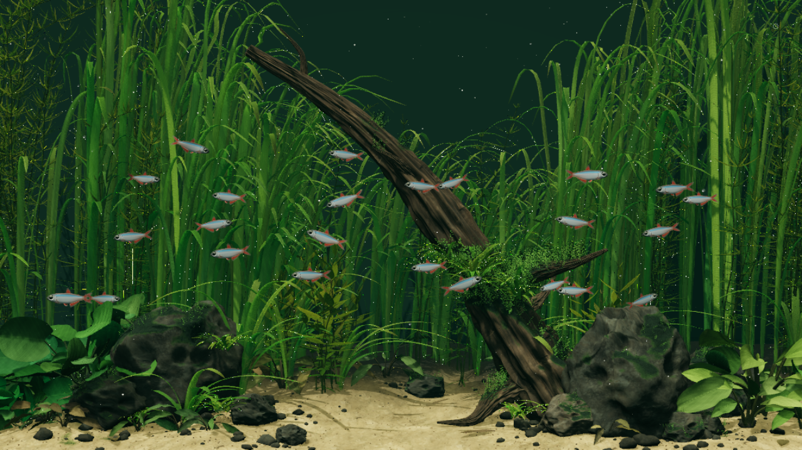

# Stillwater 2 — bể thủy sinh 3D cho Windows 11

Bản nâng cấp sử dụng cảnh Riverscape từ Desktop Habitats của Chase Lean (MIT),
được điều chỉnh cho Lively Wallpaper, đóng gói offline và hỗ trợ nhịp màn hình cao.
Đây là bản chuyển thể có ghi nguồn, không phải cảnh 3D được xây dựng hoàn toàn mới.

## Cài trên Windows 11

1. Cài Lively Wallpaper: https://www.rocksdanister.com/lively/
2. Giải nén toàn bộ gói vào một thư mục cố định, ví dụ Pictures\Stillwater.
3. Trong Lively, chọn Add Wallpaper → Choose a file → chọn **index.html** ở thư mục gốc.
4. Áp dụng wallpaper. Nhấp phải tile → Customize Wallpaper để chỉnh các tùy chọn.
5. Có thể mở index.html trực tiếp bằng Edge/Chrome để xem thử. Không cần Node.js,
   npm, server, Rive, quyền Administrator hoặc mạng sau khi đã tải gói.

Nếu dùng bản cũ, thêm bản mới như một wallpaper mới: cấu trúc và tùy chọn đã thay đổi.
Lần mở đầu có thể mất một lúc để tạo hình học và biên dịch shader. Chỉ số FPS sau
khi cảnh đã ổn định có ý nghĩa hơn thời điểm vừa mở.

## Chuyển động và hình ảnh

- 24 cá 3D: thân/vây chuyển động, phản sáng, lượn rồi lướt, khám phá không gian,
  tránh nhau, phản ứng với tốc độ di chuột và tranh thức ăn.
- Cây thủy sinh biến dạng theo dòng nước; đá, lũa, cát dùng texture màu/normal map.
- Ánh sáng HDR nội bộ được tone-map về màn hình SDR; đây không phải xuất HDR10.
- Bóng đổ, độ sâu, sương nước, hạt lơ lửng, vật liệu và lớp rêu từ cảnh gốc.
- Nhấp mặt nước để cho ăn. Trong Lively có thể dùng nút Feed fish nếu desktop
  không chuyển click xuống wallpaper. Cá có thể tránh hoặc giật mình khi chuột di
  chuyển nhanh; không phải lúc nào cũng đuổi theo chuột.

## 120+ FPS

Chọn Frame rate target:
- Native refresh (max 360): mặc định; chạy theo requestAnimationFrame của trình phát,
  giới hạn tối đa 360 FPS. Phù hợp màn hình 120/144/165/240 Hz.
- Các giới hạn thủ công: 60, 120, 144, 165 hoặc 240 FPS.

**Đây là FPS mục tiêu, không phải lời đảm bảo hiệu năng.** Màn hình 60 Hz hoặc trình
phát chỉ cung cấp callback 60 Hz sẽ không trở thành 120 Hz vì tăng tùy chọn này.
Trong Windows: Settings → System → Display → Advanced display → chọn tần số quét
cao mà màn hình hỗ trợ. Kiểm tra bộ đếm Show measured FPS ngay trong wallpaper.
Nó đo nhịp render của ứng dụng, không đo trực tiếp khung hình thực sự quét ra tấm nền.

Thiết lập để ưu tiên mượt:
- Giữ Native refresh và bật Show measured FPS.
- Render resolution mặc định 75%; giảm xuống 65% hoặc 55% nếu cần.
- Dựng hình giới hạn 4,2 triệu pixel để tránh oversampling quá mức trên màn hình 4K.
- 2× MSAA; shadow map 768 và bóng cập nhật 12 lần/giây. Cây vẫn nhận bóng
  nhưng không dựng thêm một lượt hình học cây vào shadow map.
- Hình học, chuyển động cá/cây và nhịp render vẫn độc lập với nhịp cập nhật bóng.
- Chọn GPU mạnh cho trình phát web của Lively trong cài đặt Graphics của Windows
  nếu máy có nhiều GPU. Thiết lập pause khi game/fullscreen hoặc khi dùng pin ở Lively.

Tùy chọn Light điều chỉnh độ sáng; Show measured FPS hiển thị FPS đo theo cửa sổ
khoảng 1 giây và p95 thời gian giữa các frame trong bộ đệm gần nhất. p95 thấp hơn
thường có nghĩa nhịp frame đều hơn. Các số này gồm cả thời gian chờ màn hình và
không được trình bày là thời gian GPU thuần.

## Điều khiển

- Trình duyệt: nút bánh răng góc phải; Space tạm dừng, F toàn màn hình khi trang có focus.
- Lively: Customize Wallpaper có FPS, render scale, ánh sáng, tương tác chuột,
  bộ đếm, tạm dừng và cho cá ăn.
- Bộ chọn FPS chấp nhận cả chỉ số dropdown của Lively, giá trị số và nhãn như
  `165 FPS`; dòng “Đang áp dụng” xác nhận ngay mức mục tiêu.
- Khi tab ẩn/tạm dừng, vòng dựng hình ngừng lên lịch. Tùy chọn cục bộ được nhớ;
  các giá trị do Lively cung cấp có ưu tiên khi wallpaper được mở lại.
- Icon desktop và cửa sổ có thể chặn thao tác chuột.

## Vì sao không dùng Rive ở bản này?

Rive CLI hiện hỗ trợ tạo/build cảnh bằng RML. Tuy nhiên asset tham khảo là một
cảnh WebGL2 với mesh 3D, vật liệu, ánh sáng và GLSL. Giữ Three.js giúp sử dụng trực
tiếp hình học và shader này; bản này không dùng hay yêu cầu Rive CLI.
Tài liệu Rive đã tham khảo: https://rive.app/docs/cli/getting-started

## Mã nguồn và kiểm tra

index.html + style.css + controls.js + aquarium.js là các file chạy trực tiếp.
Texture được nhúng trong aquarium.js để tránh lỗi module/CORS khi mở file://.
scenes/riverscape/src, scenes/riverscape/assets và vendor chứa nguồn chỉnh sửa.
Để build lại: cài Node.js, chạy `npm install`, `npm run build`; `npm test` chạy
kiểm tra hành vi cá, ngân sách cây và nhịp frame giả lập.

Xem VALIDATION.md cho kết quả kiểm tra và giới hạn của môi trường kiểm thử.
